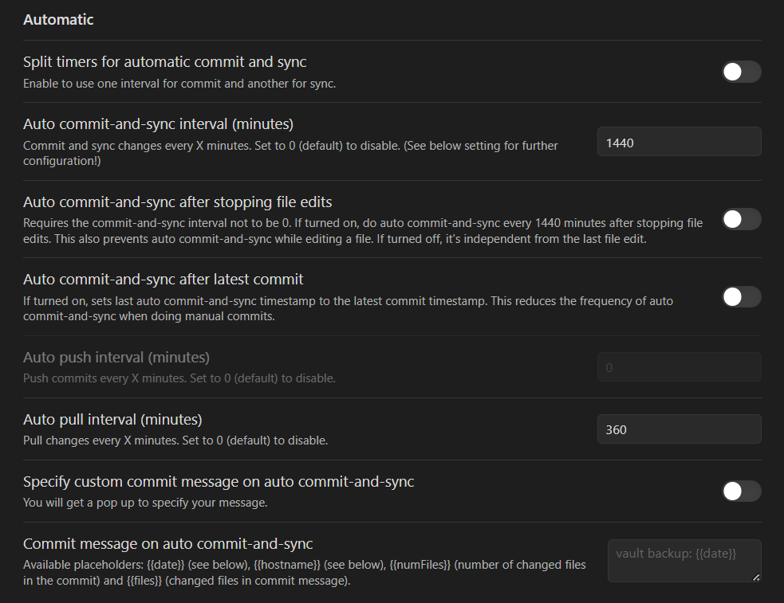
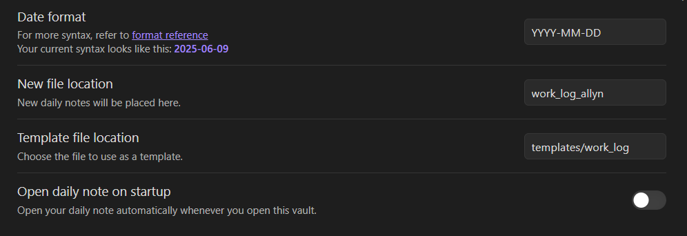
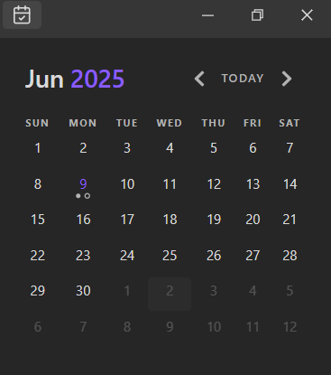
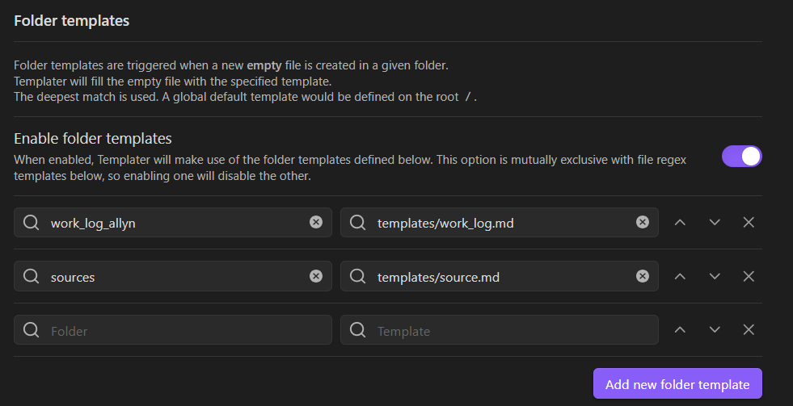

Obsidian vault for the pRNA (Partial Reconfigurable Neural Array) project at Vivum AI. 
## Plug-ins
Below are descriptions and recommended settings of the plugins utilized in this vault. Daily Notes and Calendar are used for work logs, while Git and Templater are used through the vault.
### Obsidian Git
[Obsidian Git](https://publish.obsidian.md/git-doc/Start+here) can be used to automatically sync notes. It can be helpful to configure the plug-in to automatically push/pull at specified intervals. My settings: 

### Daily Notes
I use the built-in [daily notes](https://help.obsidian.md/plugins/daily-notes) plugin to keep track of my work log. My settings: 

### Calendar
I also use the [calendar](https://github.com/liamcain/obsidian-calendar-plugin) plug-in (with default settings) to be able to easily navigate between my notes:

### Templater
Finally, I am using the [Templater](https://github.com/SilentVoid13/Templater) plug-in to handle the templates for my [worklog](templates/work_log.md) and [sources](templates/work_log.md). This plug-in allows me to easily to sync with the previous and next work log, and record when a note was created and last modified. The plug-in must be configured to be automatically used within specified folders:
